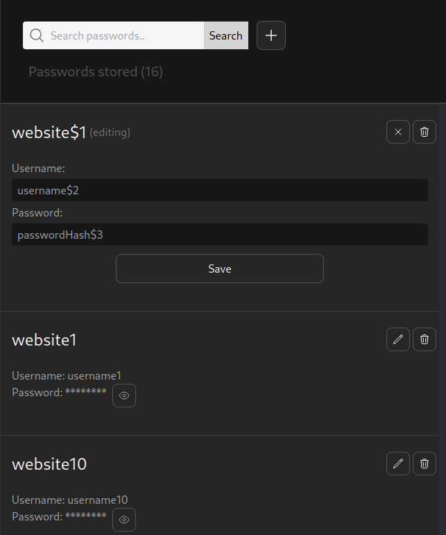

## Password manager

A simple password manager written in TypeScript. It uses Nextjs, Prisma (PostgreSQL) and Tailwind.

### Todo

- [x] Store passwords
- [x] Edit passwords
- [ ] Delete passwords
- [ ] Search passwords
- [ ] Store multiple passwords under same website
- [ ] One dialog window for all buttons instead of each entry having its own buttons in list view
- [] Toast notifications

### Previews

